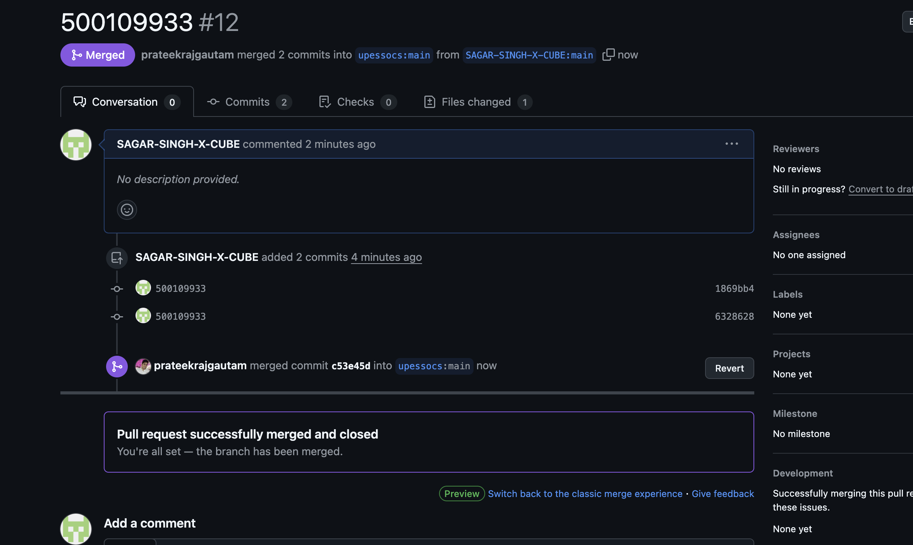
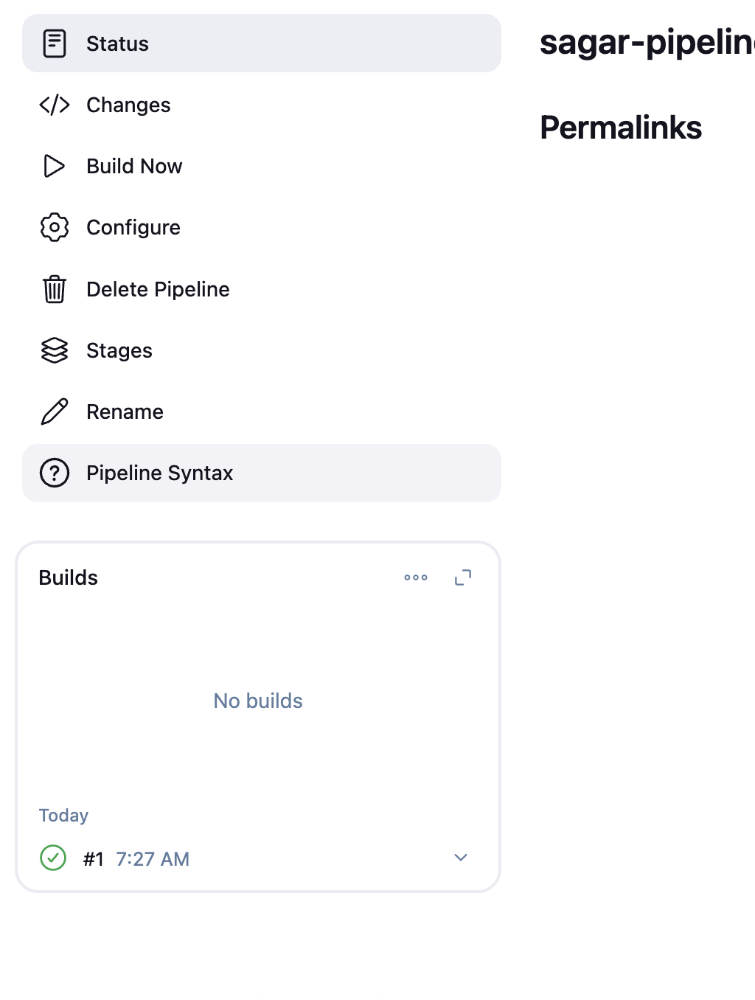

# DevOps-LABFILE

# LAB-1 GIT COMMANDS


**This repository contains the practical lab files and exercises related to DevOps, including Git operations and version control demonstrations.**

Cloning the Repository
To begin, clone this repository using the following command:

```bash
git clone https://github.com/SAGAR-SINGH-X-CUBE/DevOps-LABFILE.git
```


**Staging, Committing, and Pushing Changes**
After making changes to the repository (e.g., editing files, creating new ones), use the following commands to stage, commit, and push those changes:

```bash
git add .
git commit -m "figure 1"
git push
```


git add . stages all modified and new files.

git commit -m "figure 1" saves the changes with a commit message.

git push uploads the changes to the remote GitHub repository.


**Checking the Status of Your Working Directory**
To view the current state of your working directory, run:

```bash
 git status 
 ```


**Viewing Code Differences**
To examine the changes you made before committing, use:

```bash 
git diff
 ```


# LAB-2 GIT COMMANDS
*BRANCHING*


Create a file and do 3 commits in it
1st change
```bash
git add .
git commit -m "version1"
```
2nd change
```bash
git add .
git commit -m "version1"
```

3rd change
```bash
git add .
git commit -m "version3"
```


View all commits by using git log

```bash
git log
```


```bash
git branch featur1
git log
```


CREATE NEW FILE AND ADD TWO COMMITS
```bash
git add.
git commit -m "feature commit 1"
```
```bash
git add.
git commit -m "feature commit 2"
```


```bash
git checkout master
git log
```


#Merging
```bash
git checkout feature1
git log

```


Do the comit 3 in feature branch
```bash
git add .
git commit -m "feature done"
git log

```


switching to master branch and perform merging
```bash
git checkout master
git merge feature1 -m "Merging featutre 1"
git log

```


*RESET*
```bash
git reset --hard a462d13e9a
git log
``` 

*GIT RESET --HARD:Removed the merge commit 13dd279 and deleted all merged changes.*
*GIT RESET --SOFT:Would have removed the merge commit but kept changes staged, allowing you to re-commit easily.*

*REBASE*

```bash
git checkout feature1
git rebase master
git log
``` 


#GIT SUBMODULE

CREATE THREE REPO IN GITHUB
AND CLONE IT TO YOUR PC
REPO1:MAIN-add index.html file->add->commit->push
REPO2:CSS-add style.css file->add->commit->push
REPO3:JS-add script.js file->add->commit->push


open integrated terminal of MAIN repo
```bash
git submodule add https://github.com/SAGAR-SINGH-X-CUBE/JS.git css
git submodule add https://github.com/SAGAR-SINGH-X-CUBE/CSS.git css
git add .
git commit -m "submodule added"
git push

```


#Hosting Submodule
Create a repository with the same name as github username
*SAGAR-SINGH-X-CUBE.github.io*
Go to your repository: SAGAR-SINGH-X-CUBE.github.io
Click on "Settings" → "Pages"
Under "Branch," select main.
Click "Save."


#SUBVERSION


>CREATE A REPOSITORY
```bash
sudo mkdir -p /var/svn/repos
sudo svnadmin create /var/svn/repos/myrepo

```
>Confgure SVN Server
```bash
sudo nano /var/svn/repos/myrepo/conf/svnserve.conf

```


```bash
anon-access = none      # Disable anonymous access
auth-access = write     # Allow authenticated users to write
password-db = passwd    # Use the passwd file for authentication


```


>SET UP THE USER
```bash
sudo nano /var/svn/repos/myrepo/conf/passwd

```

```bash
alice = alicepassword
bob = bobpassword
```


>START SVNSERVER

```bash
sudo svnserve -d -r /var/svn/repos

```

>Restart the server
```bash
sudo pkill svnserve
```

```bash
sudo pkill svnserve
```

```bash
cd /path/to/repo/conf/
cd /var/svn/repos/myrepo/conf/
svnserve -d -r /var/svn/repos/

```

>CLIENT SIDE
```bash
svn checkout svn://localhost/myrepo --username alice
cd myrepo

echo "Hello, SVN!" > file.txt
svn add file.txt
svn commit -m "Added file.txt"
svn update
svn status
svn log

```


# FORK





# DOCKER

```bash
docker -v

```

```bash
docker pull hello-world

```

```bash
docker images

```


```bash
docker run hello-world
```


```bash
docker run -it ubuntu

```


```bash
docker ps -a

```


```bash
docker ps -a
docker start youthful_yonath
docker ps
docker stop b8fe5708c23b
docker ps

```


```bash
docker ps -a
docker start youthful_yonath
docker ps
docker stop b8fe5708c23b
docker ps

```
docker rmi hello-world
docker ps -a
docker rm 33dc638eb2c4
docker rmi hello-world


# Jenkins





